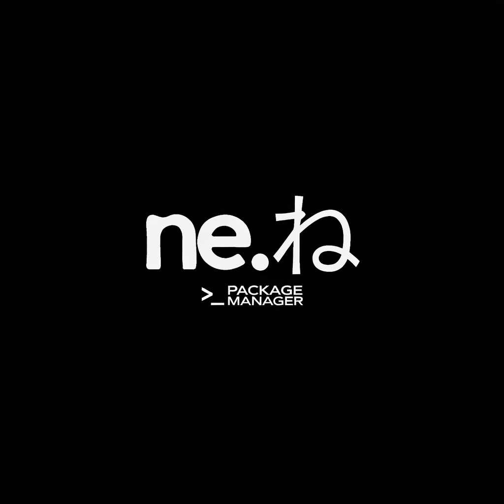

# nene |   Package Manager 
## Summary

Nene is both a static site and a set of Bash tools you can run straight from your terminal.

<p align="center">
  
</p>

## Descriptions

Not Echo, Not True is a network-based Bash script collection tool that uses the concept of process substitution with the help of the curl tool to run scripts from the internet directly inside the Terminal, with a pattern like `Source <(curl-L URL)'. Although the implementation uses source, the project name is inspired by the Bash idiom Echo <(True). The pun "Not-echo not-true" represents a transition from the basic Bash syntax that can create a more dynamic execution model, a new standard in running scripts that is more modern, distributed, and still understandable - breaking the comfort of classic shell games with the innovation of static web-based execution.

The app will execute any /endpoints from the luisadha.github.io site with a curl sourced from bash.
## Sites
not-echo-not-true.carrd.co | Developments
nenefuzzy.online |  Productions

## List Contents

Path == myApps

See https://luisadha.github.io/ {myApps} Change {myApps} to route each of my curl-based applications and follow each page's instructions on how to run those curl-based scripts (see: Usage in bold) or simply use this nene script to collect them

Exclusion site https://alrc.luisadha.my.id This subdomain will be always for Alrc Installer project

## API
API Instructions

To start using the API, you must fully install the Nene script via Basher.
[See how to instalations](#install)

Once installed, run:
```sh
nene -a
```
This command will install additional features, the nene-ak47.sh script.

Then, to replace your current termux-url-opener, use the following command:
```sh
nene -i weapon-url-opener-nightly
```
This will display an interactive fuzzy search dialog.
Select nene-ak47 to enable the "Share to Termux" button feature on supported web apps.

## Run
```sh
nene
```
## Install 
```sh
basher install luisadha/nene
```
## Update
```sh
basher upgrade luisadha/nene
```
## Uninstall
```
basher uninstall luisadha/nene
```

## Licenses

This project is licensed under the [MIT License](LICENSE).

